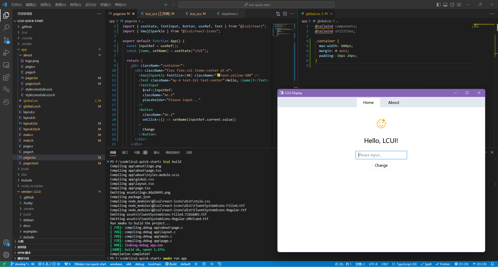

<p align="center">
  <a href="http://lcui.org/">
    
  </a>
  <h3 align="center">LCUI</h3>
  <p align="center">
    The C library for build user interfaces
  </p>
  <p align="center">
    <a href="https://github.com/lc-soft/LCUI/actions"></a>
    <a href="https://codecov.io/gh/lc-soft/LCUI"></a>
    
    
  </p>
</p>

## Table of contents

<!-- TOC -->

- [Table of contents](#table-of-contents)
- [Introduction](#introduction)
  - [Main Features](#main-features)
  - [Overview of Features](#overview-of-features)
  - [Architecture](#architecture)
- [Quick Start](#quick-start)
- [Documentation](#documentation)
  - [Tutorials](#tutorials)
  - [References](#references)
- [Roadmap](#roadmap)
- [Contribution](#contribution)
- [FAQ](#faq)
- [License](#license)

<!-- /TOC -->

## Introduction

[中文版说明文档](README.zh-cn.md)

LCUI is a library written in C for building graphical user interfaces. Its goal is to explore and practice new ways of developing user interfaces, characterized by its small size, ease of use, and provision of convenient development tools to help developers quickly create desktop applications with graphical user interfaces.

**LC** originates from the initials of the author's name. The library was initially designed to help the author develop small projects and gain development experience. However, the author did not gain a competitive advantage in the job market, which is crowded with C/C++ experts, and thus had to work in web front-end development. As a result, LCUI now leans towards integrating technologies from the web front-end domain.

### Main Features

- **Cross-Platform:** Supports Windows and Linux.
- **Fully Custom-Drawn Components:** Components maintain a consistent appearance and behavior across multiple platforms.
- **Built-in CSS Engine:** Supports using CSS to define the style and layout of the user interface, making it easier to get started for those with web development experience.
- **Provides Modern Development Tools:** The tools allow you to use the [TypeScript](https://lcui-dev.github.io/docs/guide/typescript) language with JSX syntax, the React library, and other web front-end technologies to write user interfaces.

### Overview of Features

You can learn about the development experience of LCUI applications from the following screenshot:



- **Component Development in React-like Style:** Writing UI configuration files using TypeScript. With the combined advantages of TypeScript, JSX syntax, and the LCUI React library, you can succinctly describe interface structure, resource dependencies, component states, data binding, and event binding.
- **Various Stylesheet Writing Methods:** [Tailwind CSS](https://tailwindcss.com/), [CSS Modules](https://github.com/css-modules/css-modules), [Sass](https://sass-lang.com/), and global CSS.
- **File-system based router:** Organize application pages in directory form, with each page corresponding to a directory. The path of the directory serves as the route for that page. With the built-in application router, you can easily implement page switching and navigation without manual route configuration.
- **User-friendly and Modern Icon Library:** Icons are sourced from the [fluentui-system-icons](https://github.com/microsoft/fluentui-system-icons) library, with partial customization to fit LCUI's characteristics, offering similar usage patterns.
- **Command-line Development Tool:** Run the `lcui build` command to preprocess configuration files within the app directory, then generate corresponding C source code and resource files.

### Architecture

Over time LCUI has been built up to be based on various libraries:

- [lib/yutil](./lib/yutil): Utility library providing common data structures and functions.
- [lib/pandagl](./lib/pandagl): PandaGL (Panda Graphics Library), offering font management, text layout, image I/O, graphics processing, and rendering capabilities.
- [lib/css](./lib/css): CSS parser and selector engine providing CSS parsing and selection capabilities.
- [lib/platform](./lib/platform): Platform library offering cross-platform unified system-related APIs, including message loop, window management, input method, etc.
- [lib/thread](./lib/thread): Thread library providing cross-platform multithreading capabilities.
- [lib/timer](./ui/timer): Timer library providing the ability to execute tasks at regular intervals.
- [lib/ui](./lib/ui): UI core library providing essential UI capabilities such as UI component management, event queue, style computation, and drawing.
- [lib/ui-xml](./lib/anchor): XML parsing library providing the ability to create UI from XML file content.
- [lib/ui-cursor](./lib/ui-cursor): Cursor library offering cursor drawing capabilities.
- [lib/ui-server](./lib/ui-server): UI server providing the ability to map UI components to system windows.
- [lib/ui-router](./lib/ui-router): Router manager offering route mapping and navigation capabilities.
- [lib/ui-widgets](./lib//ui/widgets): Predefined basic component library providing basic UI components such as text, button, scrollbar, etc.
- [lib/worker](./lib/worker): Worker thread library providing simple worker thread communication and management capabilities.

## Quick Start

Before you begin, you need to install the following software on your computer:

- [Git](https://git-scm.com/download/): Version control tool used to download the source code of the example project.
- [XMake](https://xmake.io/#/zh-cn/?id=%e5%ae%89%e8%a3%85): Build tool used to build the project.
- [Node.js](https://nodejs.org/): JavaScript runtime environment used to run the LCUI command-line development tool.

Then, run the following commands in a command-line window:

```shell
# Install the LCUI command-line development tool
npm install -g @lcui/cli

# Create an LCUI application project
lcui create my-lcui-app
```

Follow the prompts provided by the commands afterward.

## Documentation

- [Online Documentation](https://lcui-dev.github.io/docs/next/guides/base/)
- [Request for Comments (RFC)](https://lcui-dev.github.io/docs/next/rfcs/)
- [Changelog](CHANGELOG.md)
- [Contribution Guidelines](.github/CONTRIBUTING.md)

### Tutorials

- [Todo List](https://lcui-dev.github.io/docs/next/tutorials/todolist): Learn the basic concepts and usage of LCUI, as well as how to use it to build interfaces and implement state management, interface updates, and interactions.
- [Rendering Fabric Animation](https://lcui-dev.github.io/docs/next/tutorials/render-fabric): Rewrite the existing fabric simulation program's JavaScript source code in C language, and use the cairo graphics library for fabric rendering. Then, apply LCUI to implement fabric animation playback and interaction.
- [Browser](https://lcui-dev.github.io/docs/next/tutorials/browser): Referencing a web browser, use LCUI to implement similar interface structure, layout, style, and multi-tab management features. Utilize LCUI's routing management functionality to implement multi-tab page state management and navigation, as well as a simple file browsing page. **(This tutorial is outdated, contributions to update it are welcome)**

### References

Some features of LCUI and related projects are inspired by other open-source projects. You can refer to their documentation to understand the basic concepts and usage.

- [DirectXTK](https://github.com/Microsoft/DirectXTK/wiki/StepTimer): Source code reference for the step timer.
- [Vue Router](https://router.vuejs.org/zh/guide/): Reference for the router manager. [Some functionalities](https://github.com/search?q=repo%3Alc-soft%2FLCUI+vuejs%2Fvue-router&type=code) also reference the source code of Vue Router.
- [Next.js](https://nextjs.org/docs/app/building-your-application/routing): Reference for route definition methods.

## Roadmap

Here are the upcoming items:

- LCUI
  - Improve API design.
  - Enhance the CSS engine to support `inherit`, `!important`, and escape characters.
  - Add [SDL](https://www.libsdl.org/) backend to replace the lib/platform library.
  - Adapt to other open-source graphics libraries for better rendering performance.
- Command-line Tools
  - `lcui build --watch`: Continuously monitor file changes and automatically rebuild.
  - `lcui dev-server`: Similar to webpack-dev-server, builds the LCUI application as a website for developers to preview interfaces in the browser.
  - Add build cache to rebuild only files that have changed.
- React Component Library: Referencing some web frontend component libraries (e.g., [radix](https://www.radix-ui.com/), [shadcn/ui](https://ui.shadcn.com/)), develop a TypeScript + React component library suitable for LCUI applications, reusing components from the [LC Design](https://github.com/lcui-dev/lc-design) component library.
- Documentation
  - Tutorials
  - Request for Comments (RFC)

## Contribution

Think LCUI is slow to update? there are many ways to [contribute](.github/CONTRIBUTING.md) to LCUI.

- [Submit bugs](https://github.com/lc-soft/LCUI/issues) and help us verify fixes as they are checked in.
- Share some interesting ideas related to GUI development in the [issues page](https://github.com/lc-soft/LCUI/issues).
- [Search for FIXME comments](https://github.com/lc-soft/LCUI/search?l=C&q=FIXME) in the source code and try to fix them.
- Fund the issues that interest you on [IssueHunt](https://issuehunt.io/r/lc-soft/LCUI) to attract other developers to contribute.
- Review the [source code changes](https://github.com/lc-soft/LCUI/pulls).
- [Contribute bug fixes](CONTRIBUTING.md).

LCUI has adopted the code of conduct defined by the Contributor Covenant. This document is used across many open source communities, and we think it articulates our values well. For more, see the [Code of Conduct](CODE_OF_CONDUCT.md).

## FAQ

**Is this a browser kernel? Or a development library like Electron that integrates the browser environment?**

No, you can think of it as a traditional GUI development library that applied some Web technologies.

**Since it supports the use of TypeScript language, why don't I use Electron?**

Yes, if you have web development experience and are willing to learn Electron, then Electron is obviously the best choice.

Given LCUI's current capabilities, it is primarily suitable for meeting the author's personal needs and developing simple tools.

**Why should I choose LCUI over other GUI libraries/frameworks?**

We suggest that you prioritize other GUI libraries/frameworks.

**How about CSS support?**

The following is a list of supported CSS features. Checked is supported (But does not mean full support). Unlisted properties are not supported by default.

<details>
  <summary>CSS feature coverage</summary>

- at rules
  - [x] `@font-face`
  - [ ] `@keyframes`
  - [ ] `@media`
- keywords
  - [ ] `!important`
- selectors
  - [x] `*`
  - [x] `type`
  - [x] `#id`
  - [x] `.class`
  - [x] `:hover`
  - [x] `:focus`
  - [x] `:active`
  - [x] `:first-child`
  - [x] `:last-child`
  - [ ] `[attr="value"]`
  - [ ] `:not()`
  - [ ] `:nth-child()`
  - [ ] `parent > child`
  - [ ] `a ~ b`
  - [ ] `::after`
  - [ ] `::before`
  - [ ] ...
- units
  - [x] px
  - [x] dp
  - [x] sp
  - [x] pt
  - [x] %
  - [ ] rem
  - [ ] vh
  - [ ] vw
- properties
  - [x] top, right, bottom, left
  - [x] width, height
  - [x] visibility
  - [x] display
    - [x] none
    - [x] inline-block
    - [x] block
    - [x] flex
    - [ ] inline-flex
    - [ ] inline
    - [ ] grid
    - [ ] table
    - [ ] table-cell
    - [ ] table-row
    - [ ] table-column
    - [ ] ...
  - [x] position
    - [x] static
    - [x] relative
    - [x] absolute
    - [ ] fixed
  - [x] box-sizing
    - [x] border-box
    - [x] content-box
  - [x] border
  - [x] border-radius
  - [x] background-color
  - [x] background-image
  - [x] background-position
  - [x] background-cover
  - [ ] background
  - [x] pointer-events
  - [x] font-face
  - [x] font-family
  - [x] font-size
  - [x] font-style
  - [x] flex
  - [x] flex-shrink
  - [x] flex-grow
  - [x] flex-basis
  - [x] flex-wrap
  - [x] flex-direction
  - [x] justify-content
    - [x] flex-start
    - [x] center
    - [x] flex-end
  - [x] align-items
    - [x] flex-start
    - [x] center
    - [x] flex-end
    - [x] stretch
  - [ ] float
  - [ ] transition
  - [ ] transform
  - [ ] ...

</details>

## License

The LCUI Project is released under [the MIT License]((https://opensource.org/licenses/MIT)).
