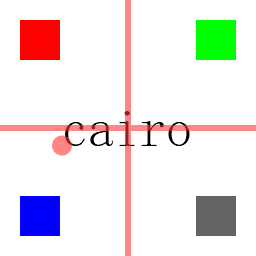

# Cairo Example

(**English**/[中文](./README.zh-cn.md))

An example of drawing with PandaGL and Cairo graphics libraries. It creates a canvas using PandaGL, then creates a Surface based on the canvas for Cairo to draw complex shapes, fills simple shapes with PandaGL, and outputs the results as a PNG image file using Cairo.

```bash
# Build PandaGL
xmake build pandagl

# Package PandaGL
xmake package pandagl

# Build example project
xmake -P .

# Run example project
xmake run -P . -w .
```

Open the output.png file and you'll see something like this:


